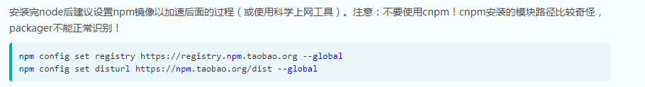
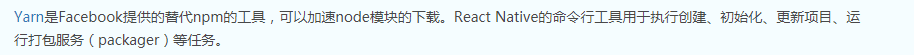
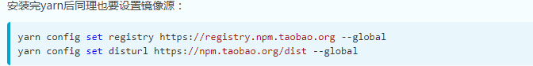

# 关于项目

此项目是基于ionic3+angular4开发的一款仅供许徐杰学习项目，请勿用于其他用途。

# 特别说明

部分API是借助第三方的API，仅供学习，请勿用于其他用途。


# 如何使用

## 安装CLI

假如已经存在beta版本，请卸载

```bash
$ npm uninstall -g ionic
```
然后

```bash
$ npm install -g ionic@latest
```

查看ionic版本号

```bash
$ ionic -version
```

## 安装Cordova

```bash
$ npm install -g cordova
```
查看cordova版本号

```bash
$ cordova -version
```

## 创建项目

* ionic start 项目名称 模板名称  
* 如：

```bash
$ ionic start demo tabs
```

# 解决npm下载慢的问题

 
 
 

附上源网址

```bash
http://reactnative.cn/docs/0.47/getting-started.html
```

## 安装JDK(真机调试的环境配置)

* 注意请安装最新版本的 JDK(下载8u111或8u112以上版本)，下载地址：http://www.oracle.com/technetwork/java/javase/downloads/index.html

## 安装Android SDK

## 在浏览器中运行
* npm config set sass_binary_site=https://npm.taobao.org/mirrors/node-sass/
* npm install
2. $ cp src/config/_config.ts src/config/config.ts
* ionic serve 或 ionic serve --address 192.168.10.113 --port 6335


----------------------------------------------------------------
## 关于Angular-cli升级

先卸载旧的
```bash
* npm uninstall -g @angular/cli
```
清除缓存
```bash
* npm cache clean
if npm version is > 5 then use `npm cache verify` to avoid errors (or to avoid using --force)
```

* npm config set sass_binary_site https://npm.taobao.org/mirrors/node-sass/ 

全局安装最新angular-cli
```bash
* npm install -g @angular/cli@latest --loglevel warn --unsafe-perm=true
```
删除项目下的文件
```bash
* rm -rf node_modules dist
```

安装到项目本地
```bash
* npm install --save-dev @angular/cli@latest
```
最后
```bash
* npm install
```
----------------------------------------------------------------